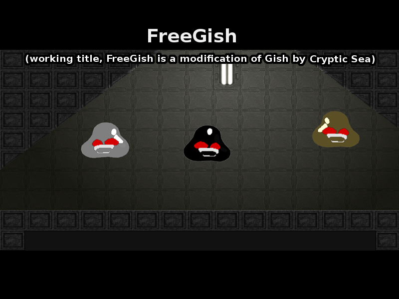

# What is GISH

Gish is a physics platformer game made by [Cryptic Sea](https://www.crypticsea.com/) and [Edmund McMillen](https://en.wikipedia.org/wiki/Edmund_McMillen). 

# What is FreeGish

Gish's code was opensourced in 2010 and this repository was created! However, assets for the game were not released and community made an effort to create new levels for this version of the game. Original features such as ability to play campaign levels with multiple players were also added.

# How to play

Download the latest release from the [release page](https://github.com/freegish/freegish/releases).
Then simply run `./gish` or `gish.exe`.

If the build for your system is not present, try building it yourself! Take a look at [COMPILE.markdown](COMPILE.markdown)

# Original assets
If you own the original assets, create a new directory named `original` in the `datapacks` directory. Then copy the files into `datapacks/original/`. You'll need:

- animation
- level
- music
- sound
- texture
- tile01 ... tile07

Afterwards run `rename-levels.sh DIRECTORY_WITH_ASSETS` script to rename files so that they match Freegish naming convention (see https://github.com/freegish/freegish/issues/2#issuecomment-48749365).

You may choose which datapack to use in the Options menu (`freegish` or `original`)

# Compiling
Take a look at [COMPILE.markdown](COMPILE.markdown)